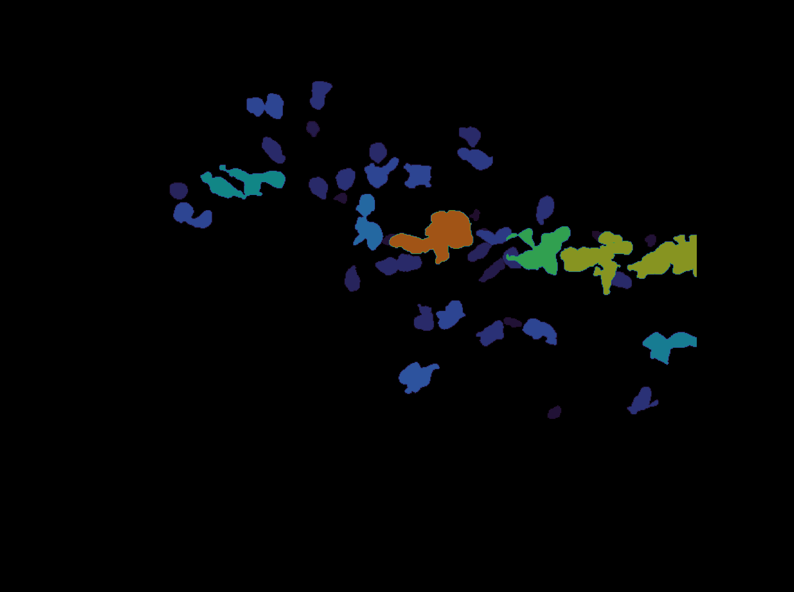

# CZBIO-Interview

This repo contains the code for the technical interview. I chose to answer the questions in [this notebook](technical-interview.ipynb) instead of the md, to easily document my thought process. For now [the cellpose colab](run_Cellpose-SAM.ipynb) is not cleaned up. Please let me know if anything is unclear.

## Todo
- [ ] requirements.txt
- [ ] clean up the imports/messy code in the main notebook make functions, remove hardcoded values, optimize memory
- [ ] clean up the colab notebook
- [ ] clean up the workspace and folders :/
- [ ] finish bonus 1
- [ ] finish tracking bonus 
- [ ] check for any mistakes
- [ ] add references